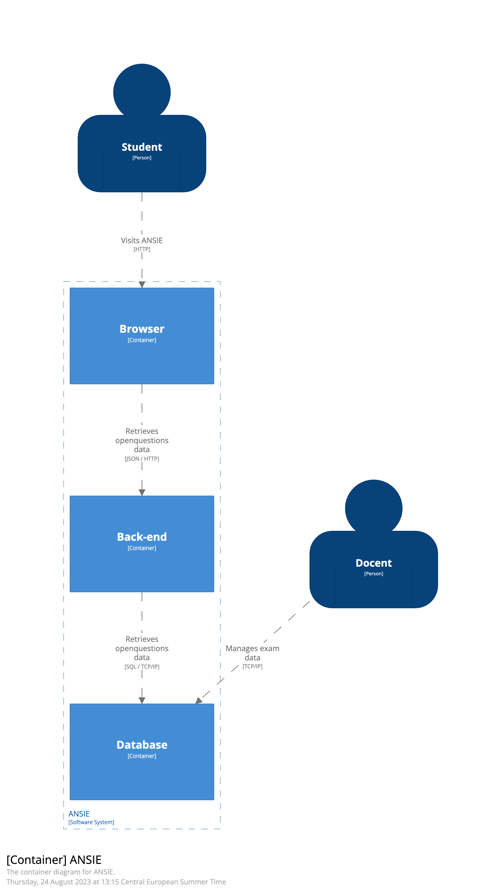
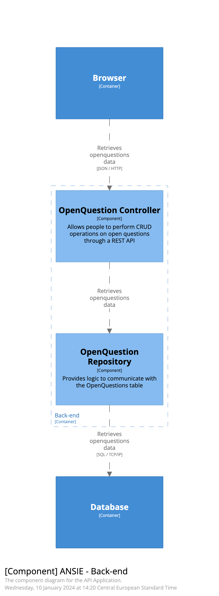

# Weekopdracht 4 voor de cursus TEEX

## Introduction

De applicatie "ANSIE" betreft een prototype van een toetsapplicatie. Op dit moment is de applicatie alleen geschikt om door een aantal toetsvragen heen te navigeren die beschikbaar zijn in de back-end. In deze week bedenk je op basis van een door jou gekozen en onderzochte NoSQL database extra features en quality attributes voor de casus.

## Context

Je kunt behalve door de toetsvragen heen navigeren ook je antwoord invoeren. Dat antwoord wordt niet opgeslagen of onthouden maar dat is voor deze opdracht niet relevant.

## Functional Overview

In deze applicatie staan toetsvragen centraal. De back-end ondersteunt verschillende vraag-types maar de front-end alleen open vragen.

User Story: 
> TODO: Breid de applicatie uit met een feature waarbij je de NoSQL database zinvol gebruikt.

## Quality Attributes

> TODO: Breid de applicatie uit met enkele quality attributes waarbij je de NoSQL database zinvol gebruikt.

## Principles

Deze applicatie bouwt voort op de onderstaande principes uit semester 1:

Back-end

- Package by layer
- Embedded Application Server
- Dependency Injection
- JDBC Templates

> TODO: Breid deze lijst uit met principes die je nodig hebt om de feature(s) en quality attribute(s) te kunnen realiseren met behoud van de huidige functionaliteit.

## Software Architecture

### Container Diagram

> TODO: Maak een nieuwe versie van het container diagram. Dit mag in de vorm van een bordtekening of gebruik makend van een tool zoals draw.io of Structurizr waar de oorspronkelijke diagrammen mee gemaakt zijn. Om Structurizr te runnen en de diagrammen te bekijken kun je [Docker](https://docs.structurizr.com/lite/installation) gebruiken.

### Component Diagram

> TODO: Maak een nieuwe versie van het component diagram. Dit mag in de vorm van een bordtekening of gebruik makend van een tool zoals draw.io of Structurizr waar de oorspronkelijke diagrammen mee gemaakt zijn. Om Structurizr te runnen en de diagrammen te bekijken kun je [Docker](https://docs.structurizr.com/lite/installation) gebruiken.

## Deployment

### Software

React
Java 17
Spring Boot
MySQL

> TODO: Breid deze lijst uit met software die je nodig hebt om de feature(s) en quality attribute(s) te kunnen realiseren met behoud van de huidige functionaliteit.

### Building

Back-end
`mvn package`

Front-end
`npm run build`

### Configuration

Back-end: Het .env bestand bevat poorten en gebruikersnaam/wachtwoord voor toegang tot de database. Deze worden automatisch gebruikt door docker compose. Sommigen variabelen zijn gedupliceerd in een .env bestand in de backend/src/main/resources/.env voor als je zonder docker compose gaat ontwikkelen.

Front-end: Geen configuratie.

## Operation and Support

Run de hele stack met Docker Compose:

`docker compose up`

De verschillende componenten gebruiken elk een eigen netwerk port.

| **component** | **port** |
| ------------- | -------- |
| db            | 3306     |
| backend       | 8080     |
| frontend      | 5173     |

### Back-end

Run de back-end met Maven:

`mvn spring-boot:run`

Of met Docker Compose:
`docker compose up backend db`

### Front-end

Run de front-end:

`npm install`

`npm run dev`

Of met Docker Compose:
`docker compose up frontend`
